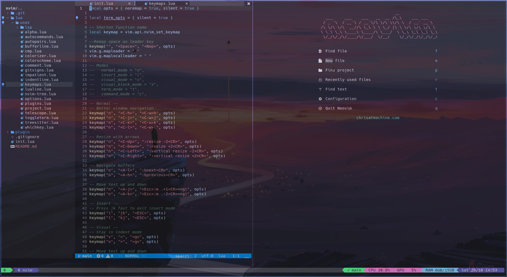

# My nvim-lua config

</br>

### Overview


</br>

Make sure that `~/.config/nvim` doesn't exist ( remove it or clone this repository in other directory to pick your desired config)

### If you want it remove ~/.config/nvim

  ```
  git clone https://github.com/edenac/nvim-lua ~/.config/nvim/
  ```

### If you want it clone in other directory to pick your desired config

  ```
  git clone https://github.com/edenac/nvim-lua ~/repos/nvim
  ```

### For this next steps Make sure to remove, move or change the name of your current `nvim` directory

**IMPORTANT** Requires [Neovim v0.8.0](https://github.com/neovim/neovim/releases). Please [upgrade](#upgrade-to-latest-release) if you're on an earlier version. 
```
git clone  https://github.com/edenac/nvim-lua ~/.config/nvim
```

Run `nvim` and wait for the plugins to be installed. (You will notice treesitter pulling in a bunch of parsers the next time you open Neovim) 

**NOTE** [Mason](https://github.com/williamboman/mason.nvim) is now used to install and manage LSP servers, DAP servers, linters, and formatters via the `:Mason` command.
## Get healthy

Open `nvim` and enter the following:

```
:checkhealth
```

You'll probably notice you don't have support for copy/paste also that python and node haven't been setup

So let's fix that

First we'll fix copy/paste

- On mac `pbcopy` should be builtin

- On Ubuntu

  ```
  sudo apt install xsel
  ```

- On Arch Linux

  ```
  sudo pacman -S xsel
  ```

Next we need to install python support (node is optional)

- Neovim python support

  ```
  pip install pynvim
  ```

- Neovim node support

  ```
  npm i -g neovim
  ```
---

**NOTE** make sure you have [node](https://nodejs.org/en/) installed, I recommend a node manager like [fnm](https://github.com/Schniz/fnm).
